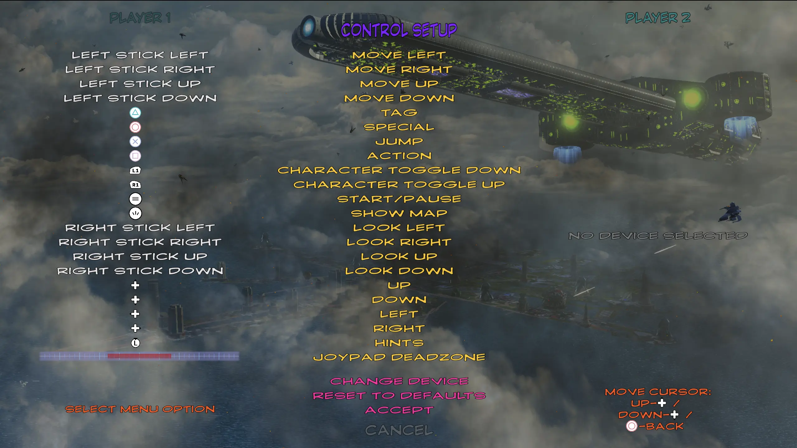
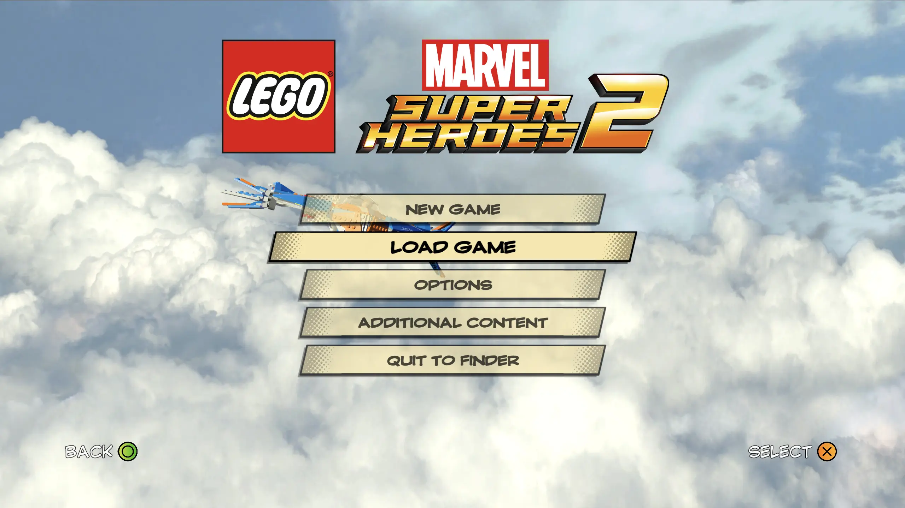

# LMSH2-DualSense

This mod for **LEGO Marvel Superheroes 2** replaces Xbox control glyphs with PlayStation DualSense controls.

  

## About

> ⚠️ **Tested on macOS only!** The file structure appears similar to Windows, but I haven’t tested it. If it works on Windows, please update the README or create an issue. Thank you!

> ⚠️ On macOS, the controller image is used from the publisher folder **(LEGOMarvelSuperHeroes2Data/feral/)**. If you will try mod on Windows, maybe you will need another file, so take it from `windows` folder

Mod includes different color variants. **PlayStation control glyphs are sourced from Steam**. 

Since the game does not natively support DualSense, I run it using Steam Input, which uses Xbox 360 glyphs by default.

## Installation

<details open>
  <summary><h3>Game files unpacked:</h3></summary>

If you already unpack game and have access to game files. (You can see folders and files in the game directory)

1. Choose your preferred control version and download mod archive (controls-name.zip) from the [release page](https://github.com/captainmarshin/LMSH2-DualSense/releases/)
2. Follow the folder structure in the downloaded archive and replace the corresponding files in your game folder

</details>

<details>
  <summary><h3>Game files packed:</h3></summary>

If you don’t have unpacked files (If you only see __disc_ and .dat files in the game folder)

> ⚠️ **It's good idea to backup original game files!**

1. Download game (I use Steam version, don’t know if it works on other versions)
2. If you have DLC, download them too
3. Download [QuickBMS](http://aluigi.altervista.org/papers/quickbms.zip)
5. Download [ttgames.bms](http://aluigi.altervista.org/bms/ttgames.bms) script for QuickBMS
6. Extract QuickBMS in folder, run `quickbms.exe` as Administrator
7. Select ttgames.bms file
8. Select all `.dat` files in game folder (including `dlc .dat` files)
9. Select folder where place unpacked files (new folder on Desktop is good)
10. After unpack complete - remove `__disc__` and all `.dat` files from original game folder
11. Move unpacked files to original game folder
12. Choose your preferred control version and download mod archive (controls-name.zip) from the [release page](https://github.com/captainmarshin/LMSH2-DualSense/releases/)
13. Follow the folder structure in the downloaded archive and replace the corresponding files in your game folder

>💡 Note: Unpacking can be a long process and the unpacked game will be significantly larger (e.g., my game went from 25GB to 32GB after unpacking).

P.S. For Windows process is same (I unpacked files on Windows), but according to [this page](https://www.pcgamingwiki.com/wiki/Engine:Nu2#Patching_executables_to_run_extracted) , you may need to patch the game’s .exe file. On macOS, no patching is needed, simply unpack and place unpacked files.

If you have any trouble, follow this video: [https://www.youtube.com/watch?v=_EQ3hPrh0V8](https://www.youtube.com/watch?v=_EQ3hPrh0V8)

</details>

## Controls version

You can choose from various color schemes for the controls!

At first, I want to create just a white DualSense control set, but after testing, I decided to offer some variants.

### PlayStation Glyphs


Original game controls with PlayStation color glyphs

    

### PlayStation Glyphs 2


Original game controls with PlayStation color glyphs

   

### Dark Buttons


Original game black controls with white glyphs and outlines

    

### Light Buttons


White color buttons with black glyphs and strokes

    

### Transparent Buttons


White color buttons with transparent glyphs and semi-transparent stroke

    

### Xbox Colors


Original game buttons with PlayStation glyphs, but ∆ O X □ have colors from original game files (Xbox colors)

    

<details>
  <summary>Bonus</summary>

### Light Buttons 2


White color buttons with full color Playstation buttons

    

### Light Buttons 3


White color buttons with colorful Playstation buttons

    

### Light Buttons Rainbow


White color buttons with rainbow glyphs and stroke

    

### Rainbow Buttons


All buttons under rainbow

    

### Transparent Rainbow Buttons


Transparent buttons under rainbow gradient.

   

</details>

## Source files

You can find original game files and PXD files in `source` folder


## Uninstall

Replace files in game folder with files from `/source/backup/`


## Paths

This is macOS paths to the game folder and mod files.

Game folder:
```bash
~/Library/Application Support/Steam/steamapps/common/LEGO Marvel Super Heroes 2
```

Game files folder:
```bash
~/Library/Application Support/Steam/steamapps/common/LEGO Marvel Super Heroes 2/LEGOMarvelSuperHeroes2Data/
```

Controller image file:
```bash
~/Library/Application Support/Steam/steamapps/common/LEGO Marvel Super Heroes 2/LEGOMarvelSuperHeroes2Data/feral/controller.png
```

This paths will be available after game files unpacking:

Control buttons file:
```bash
~/Library/Application Support/Steam/steamapps/common/LEGO Marvel Super Heroes 2/LEGOMarvelSuperHeroes2Data/FRAMEWORK-DATA/GUI/BUTTONS/PC/BUTTONICONS_DX11.TSH
```

Background texture (maybe need of Windows, no need for macOS)
```bash
~/Library/Application Support/Steam/steamapps/common/LEGO Marvel Super Heroes 2/LEGOMarvelSuperHeroes2Data/GUI/TEXTURES/PC/CONTROLLER_PC_BACKGROUND_DX11.TEX'
```
